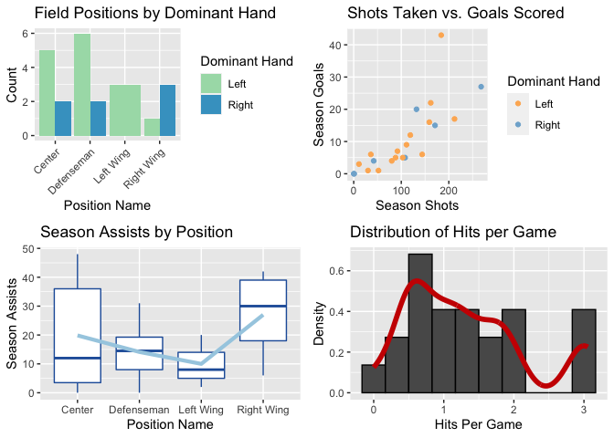
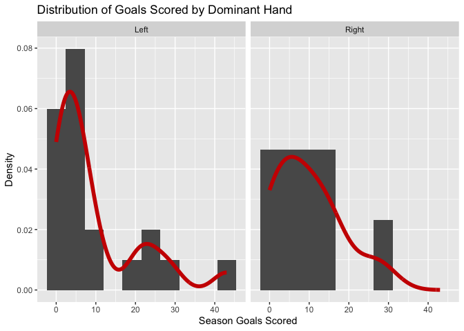

ST558 Project I
================
Mana Azizsoltani
9/4/2020

  - [Creating the Functions](#creating-the-functions)
  - [Creating a Nice Data Set](#creating-a-nice-data-set)
  - [Data Manipulation](#data-manipulation)
  - [Contingency Tables](#contingency-tables)
  - [Quantitative Summaries](#quantitative-summaries)
  - [Plots](#plots)

$ Rscript -e “rmarkdown::render(input =”ST558-RProj1.Rmd“, output\_file
=”README.md“)”

# Creating the Functions

The first thing that I did was create three functions:

1.  `getRecords()`: this function takes in an endpoint and team ID (or
    name) from the NHL Records API and queries the correct data set.  
2.  `getStats()`: this function takes in an optional modifier argument
    and queries the correct data set from the NHL Stats API.  
3.  `pullData()`: this function is a wrapper function for `getRecords()`
    and `getStats()`. It serves as a one-stop-shop for the user to
    access any of the endpoints from above APIs.

<!-- end list -->

``` r
# Write URL to access the NHL Records API
getRecords <- function(endpoint, teamID = NULL, teamName = NULL){
  base <- "https://records.nhl.com/site/api"
  table <- endpoint
  if (!is.null(teamName) & is.null(teamID)) {
    full_url <- full_url <- paste0(base, "/", table)
    data <- fromJSON(full_url, flatten = TRUE)$data %>% filter(franchiseName == teamName)
  } else if(!is.null(teamID) & is.null(teamName)) {
      full_url <- paste0(base, "/", table, "?cayenneExp=franchiseId=", teamID)
      data <-fromJSON(full_url, flatten = TRUE)$data
  } else if(is.null(teamID) & is.null(teamName)) {
      full_url <- paste0(base, "/", table)
      data <-fromJSON(full_url, flatten = TRUE)$data
    }
  return(data)
}

# write the function for the NHL Stats API
getStats <- function(modifier=NULL){
  base <- "https://statsapi.web.nhl.com/api/v1/teams"
  if(!is.null(modifier)){
    full_url <- paste0(base, modifier)
    data <- fromJSON(full_url, flatten = TRUE)$teams
  } else {
    data <- fromJSON(base, flatten = TRUE)$teams
  }
  return(data)
}

# Write the wrapper function
pullData <- function(api = c("stats", "records"), endpoint = NULL, 
                     teamName = NULL, teamID = NULL, modifier = NULL){
  if(api == "stats"){
    data <- getStats(modifier = modifier)
    }
  if(api == "records"){
    data <- getRecords(endpoint = endpoint, teamID  = teamID, teamName = teamName)
    }
  return(data)
}
```

# Creating a Nice Data Set

As a Las Vegas native, I really wanted to do something with Vegas Golden
Knights (VGK). I chose to work with roster data from the 2017/2018
season because that was their first season as a franchise. They took the
whole NHL by storm and became conference champions. I don’t really know
that much about hockey, but VGK brought the Las Vegas community together
after the tragic October 1st shooting.

All that being said, I pulled the 2017/2018 Vegas Golden Knights roster
from the `roster` endpoint. Then, since I knew exactly what I wanted in
my data, I created two loop to pull two data sets about the players out
of the `players` endpoint in the Stats API.

``` r
# read in the roster of the VGK for the 2017/2018 season
rosters <- pullData(api = "stats", modifier = "?expand=team.roster&season=20172018")
VGKrost <- as.data.frame(rosters[[30]][[31]])
VGKrost <- VGKrost %>% filter(position.code != "G") %>% select(-person.link)

# Get the stats for each individual player.
ppl <- VGKrost$person.id %>% as.vector(mode = "character")
temp <- data.frame()
df.stats <- data.frame()
for (i in 1:length(ppl)){
  url <- paste0("https://statsapi.web.nhl.com/api/v1/people/", ppl[i],
                "/stats?stats=statsSingleSeason&season=20172018")
  temp <- fromJSON(url, flatten = TRUE)$stats$splits %>% as.data.frame()
  temp$person.id <- as.numeric(ppl[i])
  df.stats <- bind_rows(df.stats, temp)
}

# Get more stats for each individual player.
ppl <- VGKrost$person.id %>% as.vector(mode = "character")
temp <- data.frame()
df.ppl <- data.frame()
for (i in 1:length(ppl)){
  url <- paste0("https://statsapi.web.nhl.com/api/v1/people/", ppl[i])
  temp <- fromJSON(url, flatten = TRUE)$people %>% as.data.frame()
  df.ppl <- bind_rows(df.ppl, temp)
}
```

# Data Manipulation

To get the data to the form that I wanted, I first had to use an inner
join to match-merge the data sets by player ID. The only problem was
that there were a bunch of redundant columns or just columns that I knew
I didn’t need, so I went ahead and removed them. After that, I went
ahead and created some new variables.

``` r
# Join the three data sets
df.ppl <- df.ppl %>% rename(person.id = id)
dfd <- inner_join(VGKrost, df.ppl, by = "person.id")
df <- inner_join(dfd, df.stats)

# Get rid of redundant rows
df <- df %>% select(-ends_with("link"), -starts_with("primary"), -ends_with("TimeOnIce"), 
                    -position.code, -person.fullName, -firstName, -lastName, -active,
                    -starts_with("birth"), -rosterStatus, -currentTeam.name, 
                    -currentTeam.id, -season, -ends_with("TimeOnIcePerGame"))


# Create new variables
df <- df %>% mutate(domHand = ifelse(shootsCatches=="L", "Left", "Right")) %>% select(-shootsCatches)
df <- df %>% mutate(goalsPerGame = stat.goals/stat.games, 
                    assistsPerGame = stat.assists/stat.games,
                    shotsPerGame = stat.shots/stat.games,
                    hitsPerGame = stat.hits/stat.games) 
```

# Contingency Tables

I created some tables for the categorical variables that I had in my
data set. I was able to see the breakdown of positions, nationalities,
and dominant hands on the team.

``` r
# Create contingency tables
table(df$position.name) %>% kable(caption = "Number of players in each field position", 
                                  col.names = c("Position", "Frequency"))
```

| Position   | Frequency |
| :--------- | --------: |
| Center     |         8 |
| Defenseman |        10 |
| Left Wing  |         8 |
| Right Wing |         4 |

Number of players in each field position

``` r
table(df$nationality) %>% kable(caption = "Number of Players by Nationality",
                                col.names = c("Nationality", "Frequency"))
```

| Nationality | Frequency |
| :---------- | --------: |
| CAN         |        16 |
| CHE         |         1 |
| CZE         |         2 |
| FIN         |         1 |
| FRA         |         1 |
| RUS         |         1 |
| SVK         |         1 |
| SWE         |         2 |
| USA         |         5 |

Number of Players by Nationality

``` r
table(df$position.name, df$domHand) %>% kable(caption = "Player Position by Dominant Hand",
                                                    col.names = c("Left-Handed", "Right-Handed"))
```

|            | Left-Handed | Right-Handed |
| :--------- | ----------: | -----------: |
| Center     |           6 |            2 |
| Defenseman |           7 |            3 |
| Left Wing  |           7 |            1 |
| Right Wing |           1 |            3 |

Player Position by Dominant Hand

# Quantitative Summaries

I then created some tables for the mean goals, assists, shots, and hits
for the different nationalities and positions. I also created a table
that displays the estimated mean and standard error of the amount of
goals scored by dominant hand to get an idea to whether or not there was
a significant difference.

``` r
# Make the first contingency table: average measurements by position
means1 <- df %>% group_by(position.name) %>% summarize(avgGoals = mean(stat.goals), 
                                                      avgAssists = mean(stat.assists),
                                                      avgShots = mean(stat.shots),
                                                      avgHits = mean(stat.hits))
means1 %>% kable(caption = "Average Season Stats by Position",
                col.names = c("Position", "Goals", "Assists", "Shots", "Hits"))
```

| Position   | Goals | Assists |  Shots |  Hits |
| :--------- | ----: | ------: | -----: | ----: |
| Center     |  12.5 |   14.50 |  94.75 | 42.25 |
| Defenseman |   3.7 |   14.30 |  76.30 | 69.70 |
| Left Wing  |  14.0 |   17.25 | 124.50 | 73.00 |
| Right Wing |  10.5 |   17.00 |  97.50 | 95.25 |

Average Season Stats by Position

``` r
# Make the second contingency table: average measurements by nationality
means2 <- df %>% filter(nationality %in% c("CAN", "CHE", "USA", "SWE")) %>%
                 group_by(nationality) %>%
                 summarise(avgGoals = mean(stat.goals), 
                           avgAssists = mean(stat.assists),
                           avgShots = mean(stat.shots),
                           avgHits = mean(stat.hits))
means2 %>% kable(caption = "Average Stats for Selected Players Nationalities",
                 col.names = c("Nationality", "Goals", "Assists", "Shots", "Hits"))
```

| Nationality |   Goals | Assists |  Shots |   Hits |
| :---------- | ------: | ------: | -----: | -----: |
| CAN         |  8.9375 |  18.375 | 104.25 | 82.375 |
| CHE         |  2.0000 |  12.000 |  26.00 | 50.000 |
| SWE         | 26.0000 |  18.500 | 132.50 | 60.000 |
| USA         |  6.0000 |  12.400 |  79.40 | 51.800 |

Average Stats for Selected Players Nationalities

``` r
# Make the third contingency table: mean & sd by dominant hand
means3 <- df %>% group_by(domHand) %>% summarise(avgGoals = round(mean(stat.goals), 3), 
                                                       sdGoals = round(sd(stat.goals), 3))
means3 %>% kable(caption = "Average Goals (and SE) by Players Handedness",
                 col.names = c("Dominant Hand", "Mean", "Std. Dev."))
```

| Dominant Hand |  Mean | Std. Dev. |
| :------------ | ----: | --------: |
| Left          | 9.714 |    11.490 |
| Right         | 9.667 |     8.602 |

Average Goals (and SE) by Players Handedness

# Plots

I stitched the four required plots (boxplot, histogram, scatterplot, and
barplot) together in a grid. They help visualize different
characteristics of the data.

``` r
# Create the required plots
plot1 <- ggplot(data = df, aes(x = position.name, fill = domHand)) + geom_bar(position = "dodge") +
           labs(x = "Position Name", y = "Count", title = "Field Positions by Dominant Hand") + 
           scale_fill_manual(values = c("#a8ddb5", "#43a2ca"), name = "Dominant Hand") + 
           theme(axis.text.x = element_text(angle = 45, hjust=1))
plot2 <- ggplot(data = df, aes(x = stat.shots, y = stat.goals, color = domHand)) + 
           geom_point() + scale_color_manual(values = c("#fdb462", "#80b1d3"), name = "Dominant Hand") +
           labs(x = "Season Shots", y = "Season Goals", title = "Shots Taken vs. Goals Scored")
plot3 <- ggplot(data = df, aes(x = position.name, y = stat.assists)) + 
           geom_boxplot(color = "#225ea8") +
           stat_summary(fun = mean, geom="line", group= 1, color= "#a6cee3", size = 1.5) +
           labs(x = "Position Name", y = "Season Assists", title = "Season Assists by Position")
plot4 <- ggplot(data = df, aes(x=hitsPerGame)) + 
           geom_histogram(aes(y = ..density..), binwidth = 1/3, color = "black") +
           labs(x = "Hits Per Game", y = "Density", title = "Distribution of Hits per Game") + 
           stat_density(geom = "line", adjust = .55, lwd = 2, color = "#CC0000")
grid.arrange(plot1, plot2, plot3, plot4, nrow = 2)
```

<!-- -->

Then, I created my fifth and final plot to show the the distribution of
the goals scored by dominant hand.

``` r
plot5 <- ggplot(data = df, aes(x = stat.goals)) + 
  geom_histogram(aes(y = ..density..), bins = 10) +
  stat_density(geom = "line", adjust = 1, lwd = 2, color = "#CC0000") + facet_wrap(~domHand) +
  labs(y = "Density", x = "Season Goals Scored", title = "Distribution of Goals Scored by Dominant Hand")
plot5
```

<!-- -->

``` r
# players <- fromJSON("https://statsapi.web.nhl.com/api/v1/roster/", flatten = TRUE)
# 
# 
# 
# 
# d <- pullData(api = "records", endpoint = "franchise-goalie-records", teamName = "Boston Bruins")
# 
# d <- getStats("?expand=team.roster&season=20182019")
# d <- getStats("?expand=team.roster&season=20102011")
# d <- getStats("?stats=statsSingleSeason&season=20182019")
# ### TEST STUFF
# 
# full_url <- "https://statsapi.web.nhl.com/api/v1/teams?expand=person.names"
# full_url <- "https://statsapi.web.nhl.com/api/v1/teams?expand=team.stats"
# d <- fromJSON(full_url, flatten = TRUE)$teams
# 
# 
# d <- getStats(modifier = "?expand=team.stats")
# 
# base <- "https://statsapi.web.nhl.com/api/v1/teams"
# d <- fromJSON(full_url, flatten = TRUE)
#   
# base <- "https://records.nhl.com/site/api"
# table <- "franchise"
# attr <- "pikachu/"
# full_url <- paste0(base, "/", table)
# data <-fromJSON(full_url, flatten = TRUE)$data
# 
# table <-"franchise-team-totals"
# full_url <- paste0(base, "/", table)
# data <-fromJSON(full_url, flatten = TRUE)$data
# 
# table <- "franchise-season-records"
# full_url <- paste0(base, "/", table)
# data <-fromJSON(full_url, flatten = TRUE)$data %>% filter(franchiseName=="Vegas Golden Knights")
# 
# table <- "franchise-goalie-records"
# full_url <- paste0(base, "/", table, "?cayenneExp=franchiseId=", id)
# data <- fromJSON(full_url, flatten = TRUE)$data
# 
# table <- "franchise-season-records"
# full_url <- paste0(base, "/", table, "?cayenneExp=franchiseId=", id)
# data <-fromJSON(full_url, flatten = TRUE)$data
```
